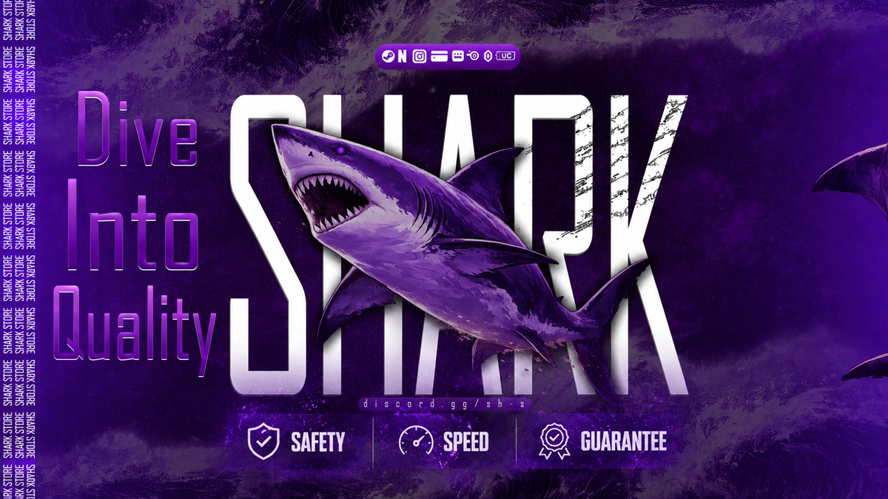

# 🦈 Shark Store — Discord Components V2 System

Purple shark-themed Discord welcome message built on **Discord Components V2**
(`IS_COMPONENTS_V2`, message flag `1 << 15` = `32768`), plus the generated banner
artwork and the Python scripts that produce both.



---

## What's in here

| File | Purpose |
| --- | --- |
| `index.html` | Live preview — renders the real V2 payload as Discord would |
| `styles.css` | Discord V2 container / gallery / section / button styling |
| `app.js` | Components V2 renderer (types 17, 12, 10, 9, 11, 14, 1, 2) |
| `payload.json` | The Discord message payload — this is the source of truth |
| `payload.js` | Same payload wrapped for the browser preview |
| `scripts/build_payload.py` | Generates `payload.json` |
| `scripts/make_rules_banner.py` | Generates `banner_rules.png` to match the other banners |
| `scripts/send_v2.py` | Posts the message to a channel via the Discord REST API |
| `*.png` | Banner assets (real SHARK STORE artwork) |

---

## Components V2 quick reference

| Type | Component | Used for |
| --- | --- | --- |
| `17` | Container | The 3 purple boxes (with `accent_color`) |
| `12` | Media Gallery | All banner images |
| `10` | Text Display | Markdown body copy |
| `9` | Section | Text + thumbnail row |
| `11` | Thumbnail | QR accessory inside the Section |
| `14` | Separator | Dividers (`spacing` 1 = small, 2 = large) |
| `1` | Action Row | Button rows |
| `2` | Button | Link + ticket buttons |

**Rules to keep in mind**

- `flags: 32768` is **required**, and it can never be removed from a sent message.
- `content` and `embeds` stop working — everything goes in `components`.
- Max **40 components** per message, max **10 children** per container.
- Attachments are not shown automatically — expose them through components.
- `poll` and `stickers` are disabled.

Current payload: **32 components** across **4 containers** (7 / 5 / 6 / 5 children).

---

## Layout

| Container | Accent | Contents |
| --- | --- | --- |
| 1 — Welcome | `#A855F7` | Cover · intro · logo section · **full-size QR** |
| 2 — News & Ads | `#7C1FD6` | News banner → `#news` · Paid ads banner → `#paid-ads` |
| 3 — Applications | `#A855F7` | Apply To Team → `#apply-to-team` · Apply To Support → `#apply-to-support` · 2 buttons |
| 4 — Rules | `#7C1FD6` | Rules banner → `#rules` · brand bar |

### Channel mentions

Each section links to its channel with a `<#id>` mention inside a Text Display:

| Channel | ID |
| --- | --- |
| `#apply-to-team` | `1524645415109267576` |
| `#apply-to-support` | `1524645423611117658` |
| `#rules` | `1534301945722966287` |
| `#news` | `1524645355961061451` |
| `#paid-ads` | `1524645376974393436` |

IDs live at the top of `scripts/build_payload.py` — change them there and re-run it.

### Banner assets

| File | Size | Used for |
| --- | --- | --- |
| `shark_cover.png` | 1920×1080 | Container 1 header |
| `shark_logo.png` | 1080×1080 | Section thumbnail + avatar |
| `qr.png` | 1080×1080 | Full-size media gallery (not a thumbnail) |
| `banner_news.png` | 1920×768 | `#news` |
| `banner_paid_ads.png` | 1920×768 | `#paid-ads` |
| `banner_apply_team.png` | 1920×768 | `#apply-to-team` |
| `banner_apply_support.png` | 1920×768 | `#apply-to-support` |
| `banner_rules.png` | 1920×768 | `#rules` — generated by `scripts/make_rules_banner.py` to match the others |
| `brandbar.png` | 960×50 | Footer bar |

---

## Preview it locally

```bash
python3 -m http.server 8000
# open http://localhost:8000
```

Three tabs: **Preview** (Discord render), **Assets** (banner gallery),
**V2 Payload** (raw JSON + copy button).

---

## Send it to Discord

```bash
pip install requests
# edit BOT_TOKEN and CHANNEL_ID in scripts/send_v2.py
python3 scripts/send_v2.py
```

Images are referenced as `attachment://cover.png`, so the PNGs must be uploaded
in the same request under the same filenames. Swap them for CDN URLs if you'd
rather host them elsewhere.

### discord.js

```js
const { MessageFlags } = require('discord.js');
const payload = require('./payload.json');

channel.send({
  flags: MessageFlags.IsComponentsV2,
  components: payload.components,
  files: ['cover.png', 'hero_getstarting.png', /* ... */],
});
```

---

## Regenerate the artwork

```bash
pip install pillow numpy
python3 scripts/make_rules_banner.py   # rebuilds banner_rules.png to match the set
python3 scripts/build_payload.py       # rebuilds payload.json + payload.js
```

`make_rules_banner.py` rebuilds the Rules banner from `banner_news.png`: it reuses the
real background, shark badge and `discord.gg/sh-s` line, then draws the title in
**Aldrich** and the Arabic subtitle in **Cairo** (Google Fonts, OFL) at the exact same
coordinates as the source banners. Put both fonts in `fonts/` — see the `F` constant.

Pillow must be built with **raqm** for Arabic shaping (`PIL.features.check('raqm')`).

---

## Editing the copy

All text is **Lorem Ipsum** placeholder. Change it in
`scripts/build_payload.py` (the `TD(...)` strings), then re-run
`build_payload.py`. Text Display supports normal Discord markdown:
`#`/`##`/`###` headings, `**bold**`, `` `code` ``, `[links](url)`, and `-# subtext`.
